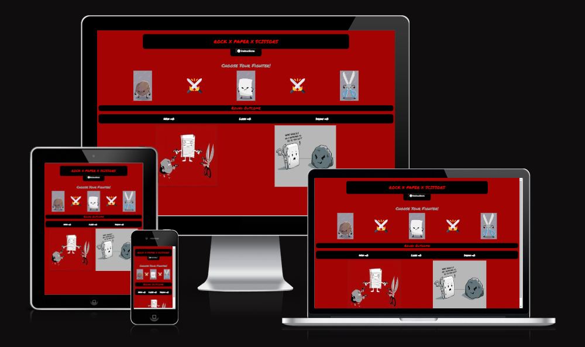
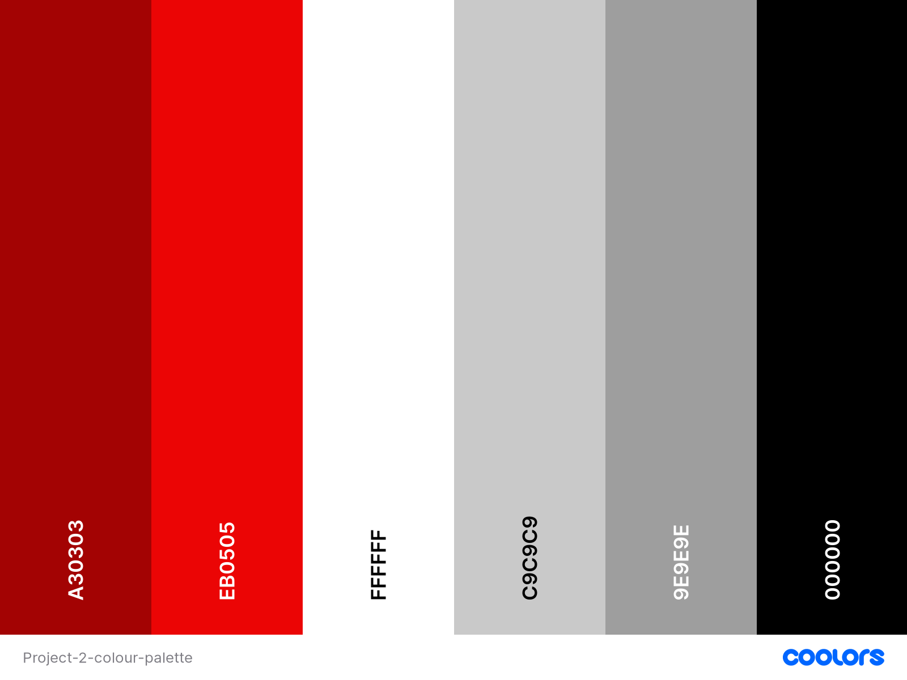

# Rock, Paper and Scissors game

I have created this rock, paper and scissors game to show my ability to work with html, css and javascript.

Rock, paper and scissors is a game mainly based on luck, you will be given 3 options to choose from to fight against the computer. Rock beats Scissors, Scissors beats Paper and Paper beats Rock.

This game will allow interactivity with the page to click on your options in the game.

### The live website can be seen by clicking [here](https://jordan-bungay.github.io/Project-2-Rock-Paper-Scissors/)

## UX

I want this game to be a fun introduction to the rock, paper and scissors game, showing you how its played through a fun interactive way. I want the user to enjoy learning the game through the exciring text and fun buttons to press.

## User stories

The goal of this game is to get people interested in how to play this game and enjoy playing rock, paper and scissors. The following points are from my user point of view:

* As a user, I want to learn how to play this game.
* As a user, I want to be able to play Rock, Paper and Scissors.
* As a user, I want to be able to play the game without any issues.
* As a user, I want to play a fun insteractive version of the game.

## Strategy

I want the game to be easy to pick up and play and to teach the player how to play Rock, Paper and scissors. I want the player to enjoy playing the game.

## Scope

I want the users to experience the game of rock,paper and scissors while also seeing my skills in creating code in javascript. I want the user to enjoy playing the game while learning it without it being too complex but enough to know how to play by the end.

## Structure

The structure of this game is to not be a lot of content to have to navigate through with everything being on one page. There is the button for the instructions you can toggle to show you how to play.

## Skeleton

I designed the website to be simple but show case all the relevant information and pictures required to get the users interested and to play the game.

**Wireframe**

I used Figma to create my wireframe for my website. The wireframe shows the very basic structure of what I saw in my head and gave guidence in to how i wanted my website structured.

You can view the screenshots from my wireframe from clicking the following:

[Click me](assets/readme-assets/Project-2-Wireframe.png)

## Surface

The Colors I have used in the website are used to match the theme of the images, and matches the main colors seen in the game. The colors I chose worked well together and gave a more exciting feel to the game.

### Color palette used

## Technologies

## Features

****

* 
* 
  

## Validator Testing

**HTML**
  
  No errors were found when passing through the official [W3C validator]()

**CSS**
  
  No errors were found when passing through the official [(Jigsaw) validator]()
  
**Accessibility**
  
  I confirmed that the colors and fonts chosen are easy to read and accessible by running it through [Lighthouse DevTools]()

## Bugs

## Deployment

I used the following steps to deploy my project:

* Go to my Github repository.
* Click on the settings tab.
* Under General, go to Code and Automation and select 'Pages'.
* In the Build and Deployment section for Source, select 'Deploy from a branch' from the drop-down list.
* For Branch, select 'main' from the drop-down list and Save.
* On the top of the page, the link to the complete website is provided.

## Credit

### Pictures

* icon used are from "https://fontawesome.com/"

### Content

* 

### Acknowledgements

* 
